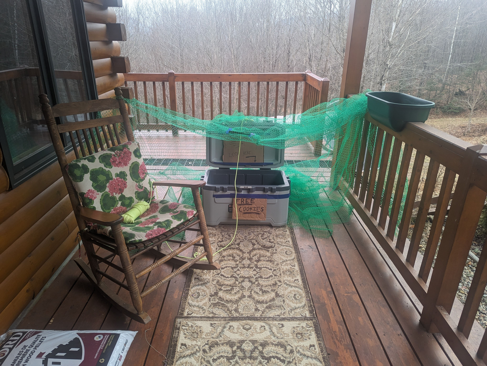
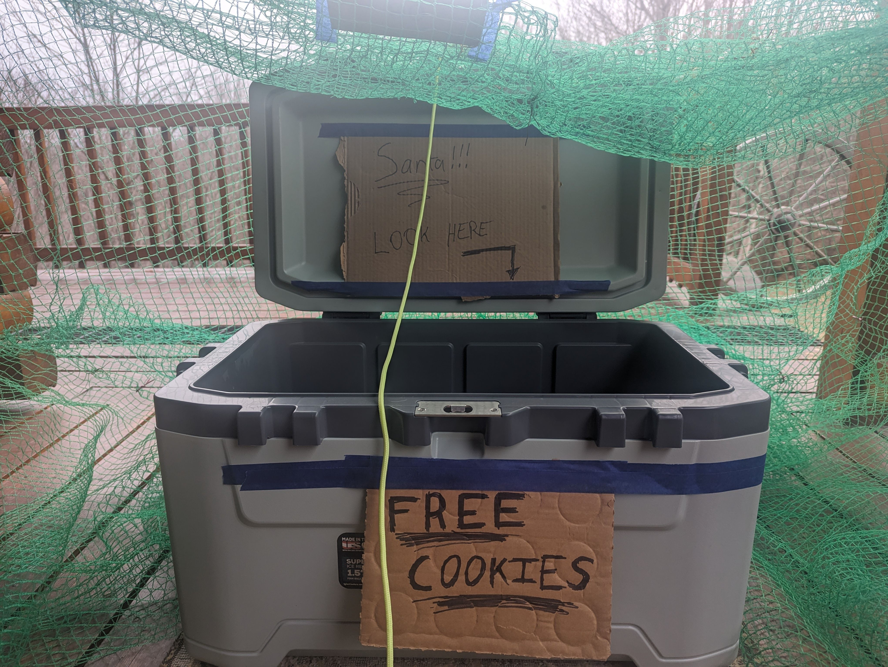

# 2023: The Cooler Trap (Origin Story)

*The one that started it all; the opening shot in a long, ridiculous, war against Santa Claus.*

> **Message to Santa (yes, you):**  
> If you’re reading this Mr. Holly Jolly Ho-Ho, just know that we’re improving... Rapidly. You may want to start stretching before Christmas Eve.

## The Origin Story

The entire Santa Trap tradition began in 2023, after my brother jokingly sang **“Kidnap the Sandy Claws”** to his daughter while they were watching *The Nightmare Before Christmas*. Her reaction was immediate outrage, followed by a slap that would make professional wrestlers cringe, and finally a stern lecture in which she made it abundantly clear that Santa Claus was far too clever to ever be kidnapped. 

Naturally, I took this as a personal challenge. In fact, I took it as a _mission_. That night, I committed myself to an idea so bold and so profoundly questionable that only Christmas magic could justify it: **I was going to catch Santa Claus**. 

---

## The Blueprint

The 2023 trap was simple, rustic, and built with the unfounded confidence of a man who believed he could outwit a centuries-old magical entity. I pride myself on my redneck engineering: this was a sure-thing. Frankly, I thought the Nobel Prize committee should’ve been on standby.  The trap consisted of a large **cooler** propped open, a **string** tied to the lid for remote closing, a **net** draped overhead for what I generously considered additional tactical coverage, and several hand-written **signs** - including:
- *“Definitely NOT a trap”*  
- *“Santa look here →”*  
- *“FREE COOKIES!”*

  

At the time, this felt like a guaranteed victory: a trap so foolproof that even Santa’s centuries of sleigh-based evasive maneuvers wouldn’t save him. The only remaining question was where I would display Santa’s hat after I captured him.

---

## Christmas Morning: The Aftermath

When my niece arrived on Christmas morning, she immediately noticed that the cooler was shut.

She did not gasp; she sprinted over screaming “He’s not in there; he’s too smart for this!” I, however, absolutely gasped, because the cooler was shut and a Santa hat was sticking out from under the lid. For a fleeting moment, victory felt within reach. We opened the cooler together, bracing for the triumphant reveal of our festive prisoner. Instead, we found a **stocking full of coal**; a **letter from Santa**; and absolutely **no Santa**. Classic Claus maneuver; he slipped the trap, left a note, and annihilated my dignity in the process. This was not merely evasion; it was psychological warfare. Santa did not simply escape; he escaped and then roasted me in rhyme. Absolutely unreal.

---

## Santa’s Letter

Inside was a personalized letter addressed to my niece.  This was crafted with the smug confidence of a man who had slipped past my trap without breaking a sweat:

> **“Dear Munchkin,  
> Ho ho ho, Munchkin, my dear,  
> It’s Santa here, spreading joy and cheer.  
> Your uncle and dad made quite the plot,  
> But catching Santa? Well, they gave it a shot!  
>   
> You’ve been good, my dear little friend,  
> Your kindness and love, they never end.  
> Your uncle and dad, they mean no harm,  
> Their antics add to the Christmas Charm!  
>   
> But here’s the truth, between you and me,  
> Your dad and uncle, they’re not that sly, you see.  
> I’ll keep delivering gifts, to your delight,  
> They can’t catch Santa, try as they might!  
>   
> Merry Christmas, Munchkin, so sweet,  
> To the girl who makes Santa’s job a real treat.  
> Keep being wonderful, that’s the key,  
> Merry Christmas to you, from Dancer and me!”**

Santa had the audacity to mock our efforts; he roasted us in rhyme; he involved a reindeer as a co-conspirator. This was not a simple message; it was a declaration of Christmas hostility. In that moment I knew that Santa had escalated the situation and that I was now morally obligated to respond.

---

## Reflection

Looking back, the 2023 trap was simple, impressively ineffective, and almost enough to make Santa sweat (although he would never admit it). We may have launched this annual battle with Santa, but he made one thing abundantly clear: this war is far from over.

Santa, if you are reading this (and I assume you are monitoring your opponents), know this: we are learning; we are improving; and we are coming for you.

*Enjoy your freedom while it lasts, old man; Christmas comes every year, and so do we.*
